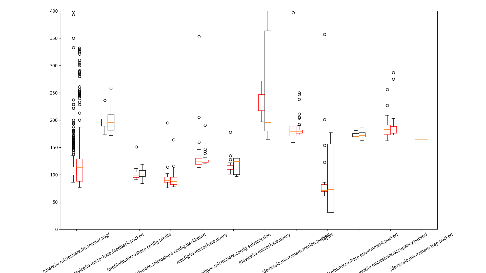
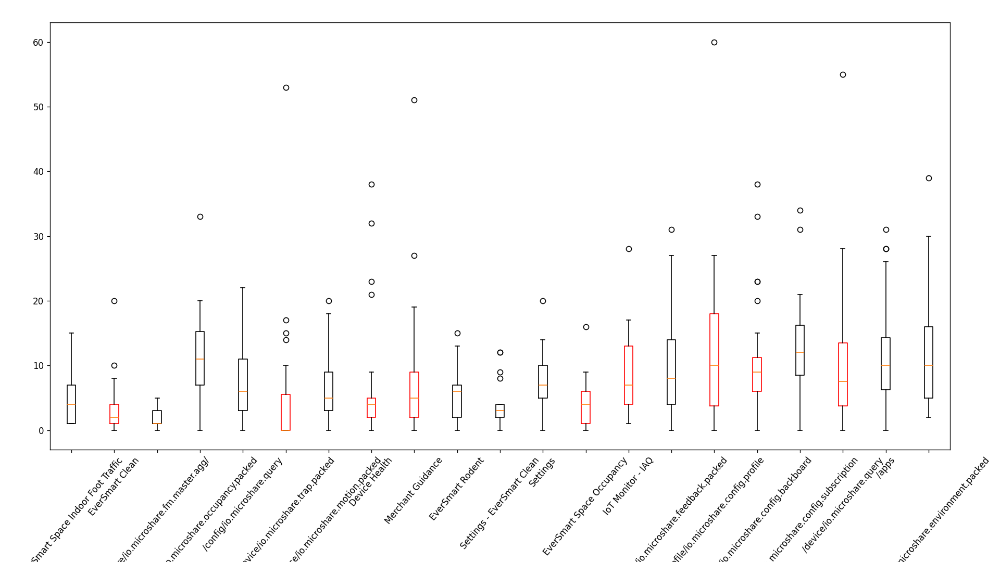
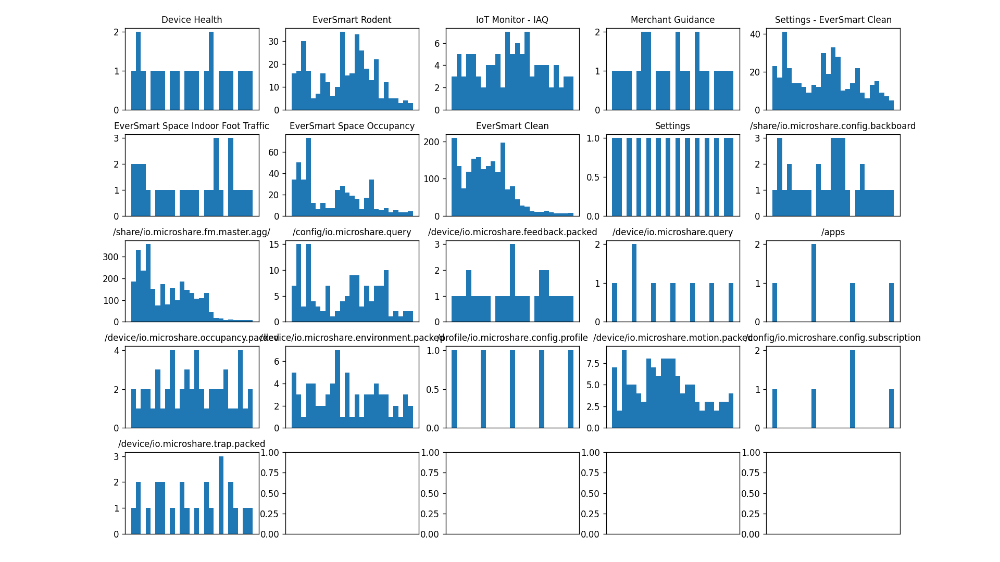
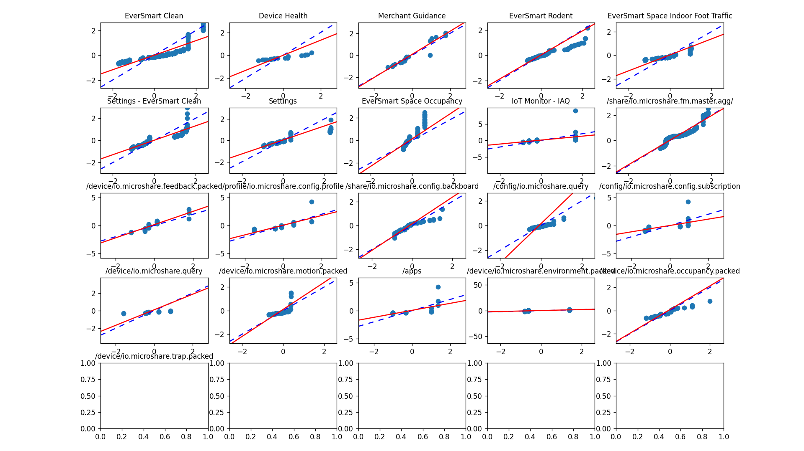

# JMeter Stats
A set of scripts for running latency tests through JMeter and gathering statistics on its output.

# Prerequisites
1. JMeter test plans (and only JMeter test plans) in the ./tests directory
2. JMeter tree results csvs (and only such csvs) in the ./results directory; ideally the JMeter tests in ./tests are configured to save their csvs to this location
3. JMeter, python, and matplotlib installed

Running the JMeter tests anew every single time is not strictly necessary; if there are already sufficient .csv files in ./results, commenting out the jmeter -n -t $csv line in the load test script will allow for the logs to be re-written and graphs to be re-plotted

# Usage
A complete run of the app given only JMeter test plans can be accomplished by running:
```
chmod +x loadtest-stats.sh
./loadtest-stats.sh
```
in this directory on MacOS or Linux, and by running loadtest-stats.bat on Windows

jmeter-plots.py can also be run on its own for the purpose of generating some particular graph for one or two given csv results files. A complete list of command-line options can be viewed by running
```python jmeter-plots.py --help```
in this directory

# Example output
The included JMeter test plans were made for [Microshare](https://www.microshare.io) and were used to check the assumption that multiple users logging onto their service simultaneously would increase latency and alter the distribution of load times. Each plan runs 9 threads in parallel, one for each app available to users from a landing page. A random subset of these stop before actually loading their app, so when the latency times are saved to the CSV file, the thread number of each request can be used to identify the app being loaded during a specific request. This lets us compare the effects of up to 9 users logging on at once not just between different resources being accessed, but also for any apps loaded in both of two test runs. For other use cases, you will need to edit the jmeterCSV method in jmeter-plots.py

If you have installed the dependencies and set up your JMeter files in the correct locations, the output should look similar to the output of this assumption-checking run.

Candlestick output:


CorrelationBPlot output:


Histogram output:


Q-Q output:

